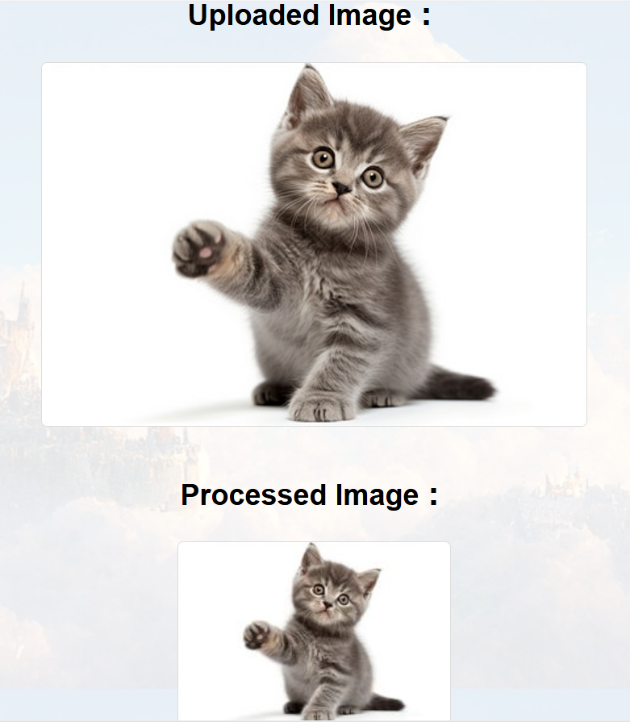

## 概要
学部時代に中国の東北大学の学生の方々とチームで制作したWebアプリケーションです。
Djangoを使用して簡単な画像処理を行えます。
私は主にDjangoを用いたアプリのUI部分を担当しました。

# Project for Image Process
This is a project for a PBL course.

The purpose of Data Agumentation is to expand the number of samples and thereby improve the robustness of the network.

## Members
Hongshu Chen (Leader)\
Wenqi Cui\
Yuliang Gao\
Rinji Nakayama\
Fumito Yoshizuka\

## Assignment
Hongshu Chen: Contol the GitLab and test the whole project.\
Fumito Yoshizuka: Django (UI design).\
Wenqi Cui: Design Fuction 1.\
Rinji Nakayama: Design Fuction 2.\
Yuliang Gao: Guide the teamwork and design Fuction 3.
